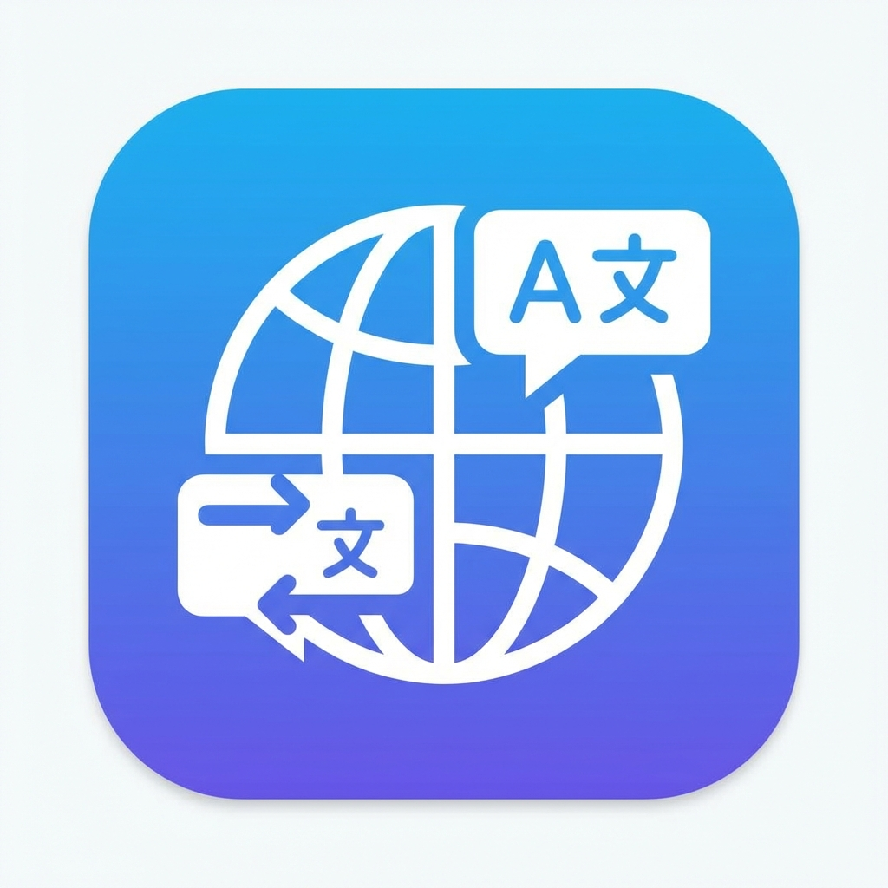

# TranslateGemma 沉浸式翻譯

<p align="center">
  
</p>

<p align="center">
  <strong>本地離線的沉浸式網頁翻譯工具</strong><br>
  使用 Google TranslateGemma-4b-it 模型，完全在你的電腦上運行
</p>

<p align="center">
  <a href="#功能特色">功能</a> •
  <a href="#快速開始">安裝</a> •
  <a href="#使用方式">使用</a> •
  <a href="#常見問題">FAQ</a> •
  <a href="#授權">授權</a>
</p>

---

## ✨ 功能特色

| 功能 | 說明 |
|------|------|
| 🌐 **網頁雙語翻譯** | 原文與譯文並排顯示，沉浸式閱讀體驗 |
| 🎬 **YouTube 雙語字幕** | 即時翻譯影片字幕，學習外語更輕鬆 |
| 🖱️ **滑鼠懸停翻譯** | 滑鼠停留段落即顯示翻譯（可獨立開關） |
| ✨ **反白選取翻譯** | 選取任意文字自動翻譯 |
| 📋 **右鍵選單翻譯** | 選取文字後右鍵快速翻譯 |
| ⌨️ **快捷鍵切換** | `⌘⇧T` (Mac) / `Ctrl+Shift+T` (Windows) |
| 🔒 **完全離線** | 資料不離開你的電腦，保護隱私 |

### 🖥️ 跨平台支援

- **macOS**: Metal GPU 加速
- **Windows**: CUDA GPU 加速 / CPU 運算
- **Linux**: CUDA / CPU（未測試）

---

## 📋 系統需求

| 項目 | 最低需求 | 建議配置 |
|------|---------|---------|
| 作業系統 | macOS 12+ / Windows 10+ | macOS 14+ / Windows 11 |
| Python | 3.10+ | 3.11+ |
| 記憶體 | 8GB RAM | 16GB+ RAM |
| 儲存空間 | 4GB（模型檔案） | SSD 推薦 |
| 瀏覽器 | Chrome | Chrome / Edge (Chromium) |

---

## 🚀 快速開始

### 1️⃣ 安裝伺服器

```bash
# 進入 server 目錄
cd server

# 建立虛擬環境
uv venv
```

#### macOS (Metal 加速)

```bash
source .venv/bin/activate
CMAKE_ARGS="-DGGML_METAL=on" uv pip install -r requirements.txt
```

#### Windows (CUDA 加速)

```powershell
.venv\Scripts\activate
$env:CMAKE_ARGS="-DGGML_CUDA=on"
uv pip install -r requirements.txt
```

#### Windows (CPU 運算)

```powershell
.venv\Scripts\activate
uv pip install -r requirements.txt
```

### 2️⃣ 啟動伺服器

```bash
python main.py
```

> 🔄 **首次啟動**會自動從 Hugging Face 下載 TranslateGemma 模型（約 3.3GB），請耐心等待。

### 3️⃣ 安裝 Chrome 擴充功能

1. 開啟 Chrome，前往 `chrome://extensions/`
2. 開啟右上角「**開發者模式**」
3. 點擊「**載入未封裝項目**」
4. 選擇專案中的 `extension` 資料夾
5. 完成！點擊擴充功能圖示開始使用

---

## 📖 使用方式

### 整頁翻譯

1. 點擊擴充功能圖示
2. 確認伺服器狀態為「🟢 運作中」
3. 點擊「翻譯此頁面」或使用快捷鍵 `⌘⇧T`

### 懸停翻譯

- 將滑鼠停留在任意段落上約 0.5 秒
- 可在 Popup 中開關此功能

### 選取翻譯

- 選取任意文字後自動顯示翻譯
- 或右鍵選擇「🌐 翻譯」

### 快捷鍵

| 功能 | Mac | Windows |
|------|-----|---------|
| 切換翻譯 | `⌘⇧T` | `Ctrl+Shift+T` |

---

## 📁 專案結構

```
TranslateGemma/
├── server/                 # 翻譯 API 伺服器
│   ├── main.py            # FastAPI 主程式
│   ├── translator.py      # 模型包裝
│   ├── requirements.txt   # Python 依賴
│   └── models/            # 模型存放目錄
│
└── extension/             # Chrome 擴充功能 (Manifest V3)
    ├── manifest.json      # 擴充功能配置
    ├── popup/             # 彈出視窗 UI
    ├── content/           # 內容腳本
    ├── background/        # Service Worker
    └── icons/             # 圖示
```

---

## ❓ 常見問題

<details>
<summary><strong>Q: 伺服器狀態顯示「離線」？</strong></summary>

確認已執行 `python main.py` 啟動伺服器，且終端機顯示 `Uvicorn running on http://localhost:8080`。
</details>

<details>
<summary><strong>Q: 翻譯速度很慢？</strong></summary>

- 確認已使用 GPU 加速（Metal/CUDA）
- 首次翻譯需要載入模型，約需 10-30 秒
- 後續翻譯會快很多，且有快取機制

</details>

<details>
<summary><strong>Q: 廣告區塊被翻譯導致版面亂掉？</strong></summary>

v0.4.0+ 已修復此問題，會自動跳過廣告和程式碼區塊。
</details>

---

## 🔧 技術細節

- **翻譯模型**: [TranslateGemma-4b-it](https://huggingface.co/google/translate-gemma-4b-it) (Q6_K GGUF)
- **推論引擎**: [llama-cpp-python](https://github.com/abetlen/llama-cpp-python)
- **API 框架**: [FastAPI](https://fastapi.tiangolo.com/)
- **擴充功能**: Chrome Manifest V3

---

## 📜 授權

本專案採用 [MIT License](LICENSE) 授權。

### 第三方資源

- **TranslateGemma 模型**: Google，採用 [Gemma License](https://ai.google.dev/gemma/terms)
- **llama-cpp-python**: MIT License
- **FastAPI**: MIT License

---

## 🙏 致謝

- [Google](https://ai.google.dev/) - TranslateGemma 模型
- [沉浸式翻譯](https://immersivetranslate.com/) - UI/UX 設計靈感
- [llama-cpp-python](https://github.com/abetlen/llama-cpp-python) - GGUF 推論支援

---

<p align="center">
  Made with ❤️ by <a href="https://github.com/siden999">siden999</a>
</p>
